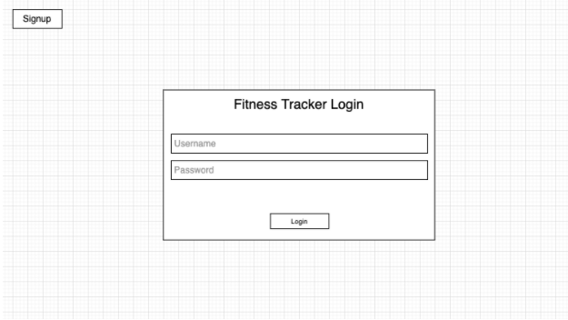
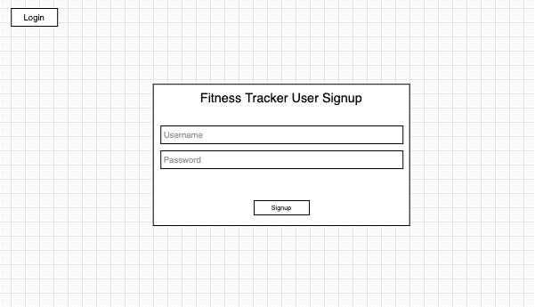
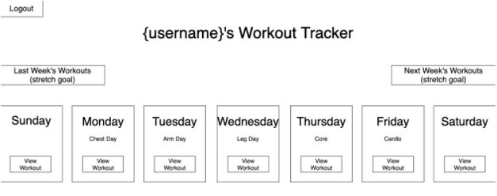
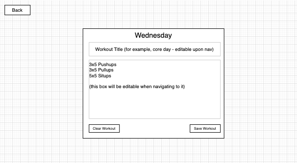

# Workout Tracker App

**Authors:** Dezerey Escanuelas, Carson Fuhs, Adewale J Dada, Marialaina Preciado

## LINK TO APP

https://exercise-log-app-frontend-main.herokuapp.com/

## TECHNOLOGIES USED

- HTML
- CSS
- Javascript
- React
- Bootstrap

## PROJECT SUMMARY

The Workout Tracker App allows a user to save their workout routine for the week.
This project was created by a team of students in the General Assembly Software Engineering Immersive course. This repository is for the frontend of this app.

## APPROACH TAKEN

A user is able to see a login or signup page when they open the link to the app. When the user signs up, their information is stored in a database. JSON Web Tokens (JWT) were used to authorize the user’s request while they are logged in. The user is now shown the main page with the seven days of the week in cards that were styled with Bootstrap. Each card has a “view workout” button which when clicked, displays a page with an empty form that the user can fill in and save. Once the card is filled, the user will also have the ability to edit or clear the workout from that card.

## USER STORIES

- As a user, I am able to create an account so that I am able to log in to use the app.
- As a user, I am shown a page that will show my workouts for the week so that I can keep track of my exercise routine.
- As a user, I have the ability to create my workout for the chosen day so that I can plan my workouts for the week.
- As a user, I have the ability to edit and clear my workout for the chosen day so that I can change my workout routine for the week.

## SCREEN SHOTS

coming soon

## WIREFRAMES

**Login Page**

**Signup Page**

**Main Page**

**View Workout Page**

## FUTURE UPDATES

- create an error page for when username or password does not match
- add a button to view the previous or next week
- add a button to clear the entire week
- add more styling
